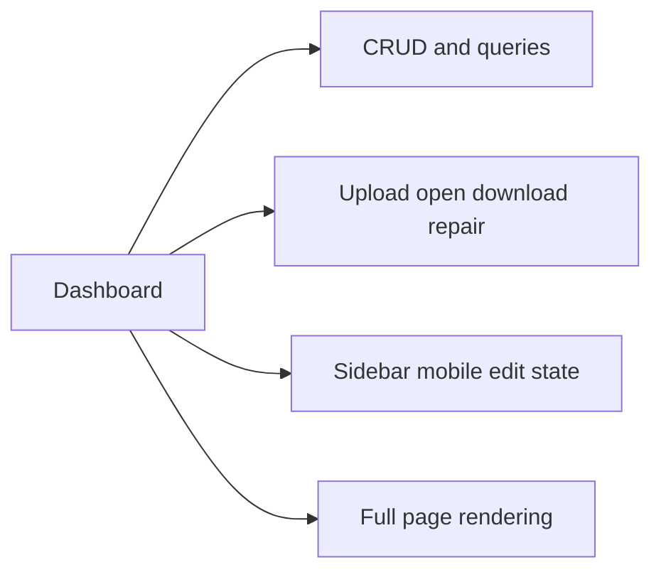
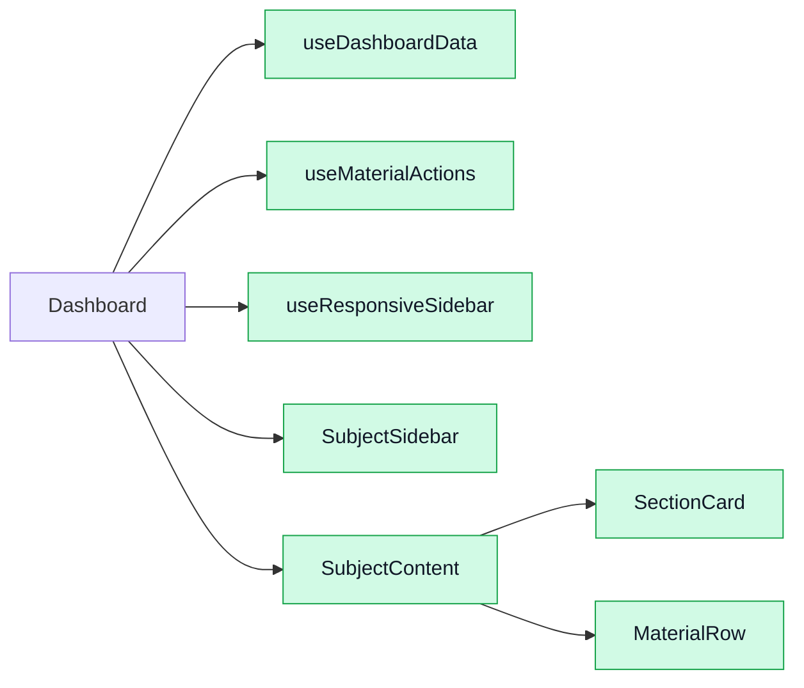

# 1. Problems

The admin dashboard in `web-admin/src/pages/Dashboard.tsx` has become the single entry point for subject, section, and material management. CRUD calls, file permission repair, upload flows, responsive state, and most JSX rendering now live in one component, so small changes tend to touch unrelated logic.

## 1.1. **Excessive Responsibility Coupling**

Scope: `Dashboard.tsx:92-805`, especially data loaders in `273-343`, CRUD handlers in `345-589`, and rendering in `605-805`.

The page owns Appwrite queries, mutation workflows, selection state, and screen composition at the same time. That makes the file a hotspot and forces developers to understand backend rules before changing simple UI text or layout. Unused state such as `showSqlHelp`, `title`, and `type` at `97-99` is a sign that responsibilities have already drifted.

```tsx
const loadSubjects = async (...) => { ...setSubjects(...) }
const addSubject = async () => { ...await databases.createDocument(...) }
const handleUpload = async (sectionId: string) => { ...await storage.createFile(...) }
return <div>{/* sidebar, forms, section cards, material rows */}</div>
```

## 1.2. **Workflow Logic Hidden in UI Event Handlers**

Scope: file access helpers in `121-271` and upload flow in `461-544`.

Open, download, and permission repair are implemented directly inside click handlers. The same recovery path is repeated twice, and `handleUpload` reads DOM nodes through `document.getElementById`, which bypasses React state. This is hard to unit test because the business rule is tied to `window`, `document`, and button clicks.

```tsx
const titleInput = document.getElementById(`title-${sectionId}`) as HTMLInputElement;
const fileInput = document.getElementById(`file-${sectionId}`) as HTMLInputElement;
const blob = await fetchGuestBlob(downloadUrl);
if (shouldAttemptPublicReadRepair(err, material)) {
  await ensurePublicRead(material);
}
```

## 1.3. **State Explosion and Render Branching**

Scope: local state in `93-111`, sidebar coordination in `591-596`, and conditional rendering in `619-802`.

The component tracks selection, editing, upload progress, mobile mode, and sidebar visibility with many loosely related `useState` calls. Some states depend on others indirectly, such as `selected`, `isMobile`, and `showSidebar`. That increases regression risk when changing layout or inline editing behavior.

# 2. Benefits

The main benefit is to turn one fragile admin page into a small page shell backed by isolated hooks and focused UI blocks.

## 2.1. **Reduced Complexity**

The current component spans about **715 lines** from function start to return. After splitting data, file actions, and presentational blocks, the page shell can reasonably drop to around **150-250 lines**, which lowers the review and modification burden.

## 2.2. **Improved Testability**

Moving file repair and upload orchestration into services or hooks allows unit tests to cover open, download, and repair branches without rendering the whole page or mocking many DOM APIs.

## 2.3. **Safer UI Evolution**

Sidebar behavior, section editing, and material rows can change independently. A responsive tweak should no longer risk breaking Appwrite mutation paths.

# 3. Solutions

Refactor the page into a thin container that coordinates dedicated data hooks, file-action services, and presentational components.

## 3.1. **Project Module Changes**



This diagram shows the current shape: one page owns nearly every admin concern.



The target shape keeps `Dashboard` as the route component, but moves data rules, file workflows, and rendering blocks behind clearer boundaries.

## 3.2. **Extract Hooks and Services: To Solve "Excessive Responsibility Coupling" and "Workflow Logic Hidden in UI Event Handlers"**

**Implementation steps**

- Create `services/materialService.ts` for URL parsing, guest fetch, and permission repair.
- Create `hooks/useDashboardData.ts` for subjects, sections, materials, and CRUD reloads.
- Create `hooks/useMaterialActions.ts` for upload, open, download, rename, and delete actions.
- Replace direct DOM access with controlled inputs or refs owned by each section card.

Before:

```tsx
const handleDownloadMaterial = async (material: Material) => {
  const blob = await fetchGuestBlob(getMaterialDownloadUrl(material));
  if (shouldAttemptPublicReadRepair(err, material)) {
    await ensurePublicRead(material);
  }
};
```

After:

```tsx
const { openMaterial, downloadMaterial, uploadMaterial } = useMaterialActions({
  storage,
  databases,
  selectedSubjectId: selected?.id,
  onRefresh: () => selected && loadMaterials(selected.id),
});
```

This keeps permission-repair rules in one place, removes duplicate branches, and makes file behavior testable without the full page.

## 3.3. **Split Presentational Components: To Solve "State Explosion and Render Branching"**

**Implementation steps**

- Keep `Dashboard.tsx` responsible for route-level composition only.
- Extract `SubjectSidebar`, `SubjectContent`, `SectionCard`, and `MaterialRow`.
- Move section form state into `SectionCard` and inline edit state into `MaterialRow`.
- Wrap mobile sidebar rules in `useResponsiveSidebar` so layout changes do not touch CRUD logic.

Before:

```tsx
{(!isMobile || showSidebar) && <div>{/* subject list */}</div>}
{(!isMobile || !showSidebar) && <div>{/* sections and materials */}</div>}
```

After:

```tsx
<DashboardShell>
  <SubjectSidebar {...sidebarProps} />
  <SubjectContent
    subject={selected}
    sections={sections}
    materials={materials}
    onUpload={uploadMaterial}
  />
</DashboardShell>
```

This change localizes state ownership. For example, editing one material row no longer forces the page component to carry row-specific state for every section.

# 4. Regression testing scope

Regress from the full admin content workflow perspective: selecting a class and board, choosing a subject, editing sections, uploading materials, and opening or downloading the saved file.

## 4.1. Main Scenarios

- Load dashboard, switch class and board filters, and confirm the subject list refreshes correctly.
- Select a subject, create a section, upload a file, and verify the new material appears under the correct section.
- Rename and delete subjects, sections, and materials, then confirm the list refreshes and selection state stays valid.
- Open and download an existing material and verify the correct file is displayed or saved.

## 4.2. Edge Cases

- Upload failure after file creation but before document creation. Confirm the error is surfaced and the page can retry cleanly.
- Material records that only have legacy `url` data and no `file_id`. Open and download should still work.
- Permission errors on file open or download. Confirm repair runs once, then the second attempt succeeds or shows a clear error.
- Mobile layout transitions when a subject is selected or cleared. The sidebar should hide and reappear without losing current data.